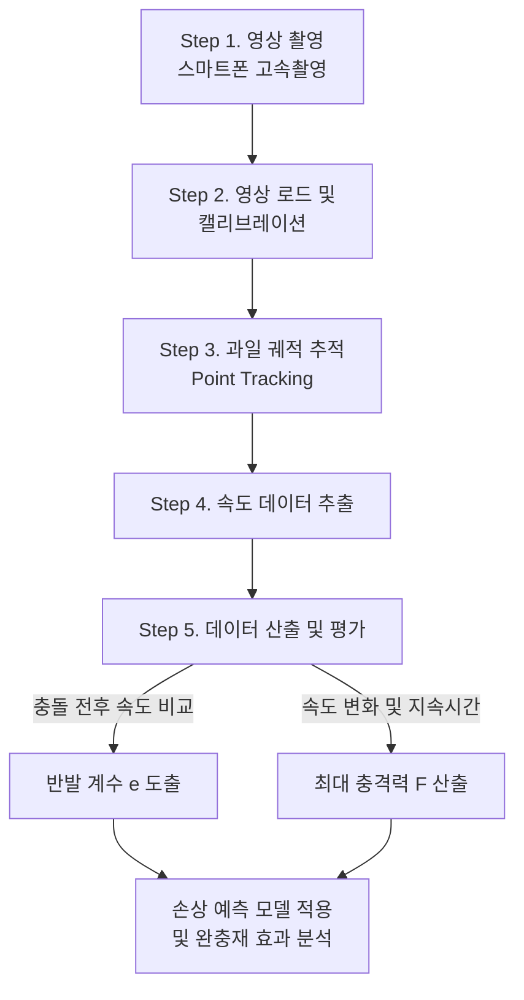
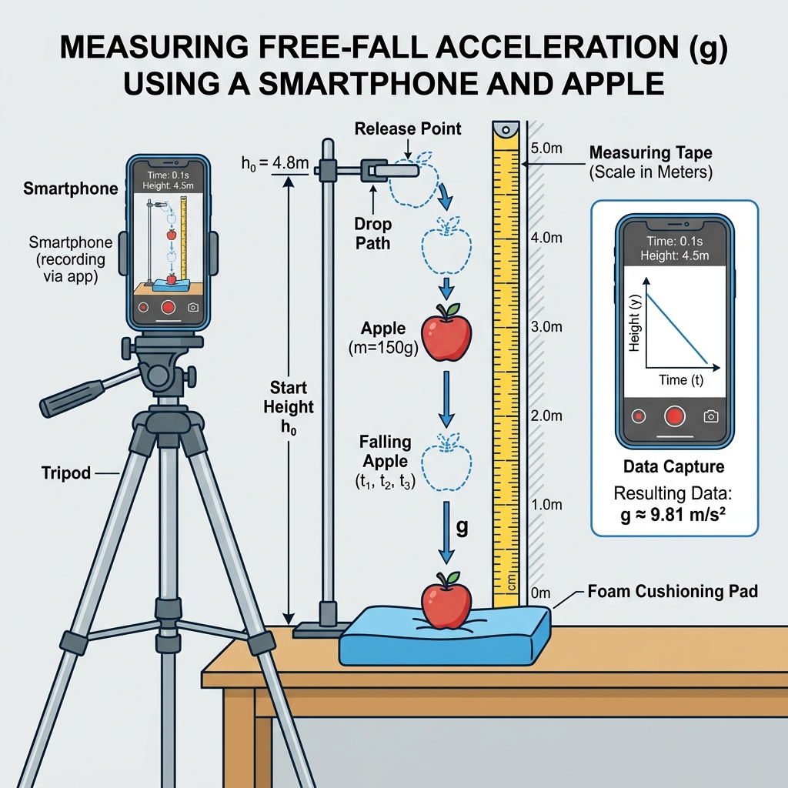

# 10주차 실습 가이드: Tracker를 활용한 과일 낙하 충격 분석

## 1. 실습 개요
- **목적**: 스마트폰 고속 촬영과 Tracker 비디오 분석 프로그램을 이용하여 과일 낙하 시 발생하는 충격 특성 및 완충재의 효과 정량 분석
- **학습 내용**: 반발 계수($e$) 도출, 충돌 지속 시간($\Delta t$) 측정, 최대 충격력($F$) 산출 및 손상 예측 모델 적용

### 🔄 전체 실습 워크플로우

## 2. 실습 준비물 및 환경 세팅
- 구형 과일 (사과, 배, 토마토 등) 1개
- 스마트폰 (슬로우 모션/고속 촬영 지원 모델 권장)
- 삼각대 (또는 스마트폰 고정 장치)
- 줄자 (영상 내 길이 캘리브레이션용, 1m 이상)
- 완충재 (에어캡, 스펀지, 골판지 등)
- Tracker 비디오 분석 프로그램이 설치된 PC

### 📸 실험 환경 세팅 모식도

> [!TIP]
> 카메라 렌즈가 과일의 낙하 궤적과 수직을 이루어야 오차가 적습니다. 또한 줄자는 과일의 낙하 궤적과 동일한 깊이(Depth)에 놓여야 정확한 캘리브레이션이 가능합니다.

## 3. 실습 단계

### Step 1: 영상 촬영 (스마트폰 슬로우 모션)
- **촬영 환경 세팅**: 
  - 카메라 렌즈가 과일의 낙하 궤적과 완벽한 수평 및 수직을 이루도록 고정
  - 낙하 궤적 바로 옆(또는 뒤)에 줄자를 펼쳐 세워 영상에 명확히 담기도록 배치
- **촬영 진행**:
  - 카메라 앱에서 **슬로우 모션(고속 촬영)** 모드 활성화 (120fps 또는 240fps 권장)
  - 과일을 일정 높이(예: 1.0m)에서 자유 낙하
  - **총 2회 촬영**: 
    1. 맨바닥(Hard Surface) 낙하
    2. 완충재(Soft Surface) 위 낙하

### Step 2: Tracker 프로그램 설정 및 캘리브레이션
- **영상 불러오기**: Tracker 실행 후 촬영한 영상 파일 드래그 앤 드롭
- **영상 클립 자르기**: 
  - 타임라인 하단의 검은색 화살표를 드래그하여 분석 구간 설정 (과일이 손에서 떨어지는 시점 ~ 바닥에 부딪힌 후 가장 높이 튀어오른 시점)
- **캘리브레이션(거리 보정)**:
  - 상단 메뉴 `Track` $\rightarrow$ `New` $\rightarrow$ `Calibration Tools` $\rightarrow$ `Calibration Stick` 선택
  - `Shift` 키를 누른 상태로 영상 속 줄자의 두 지점을 클릭하고 실제 길이(예: `1.0`) 입력
- **좌표계 설정**:
  - 상단 메뉴의 보라색 `Axes` 아이콘 클릭
  - 중심점(원점)을 과일이 충돌하는 바닥 표면으로 이동시켜 $y=0$ 기준점 설정

### Step 3: 과일 궤적 추적 (Point Tracking)
- **Point Mass 생성**: `Track` $\rightarrow$ `New` $\rightarrow$ `Point Mass` 선택
- **수동 추적(Manual Tracking)**:
  - `Shift` 키를 누른 상태로 과일의 정중앙을 클릭
  - 영상이 다음 프레임으로 넘어가면 다시 과일 중앙을 클릭하며 충돌 전후 과정을 모두 추적
  - *(팁: Autotracker 기능을 사용하면 색상 대비를 이용해 자동 추적 가능)*

### Step 4: 데이터 추출 및 반발 계수($e$) 계산
- **속도 그래프 활성화**: 우측 그래프의 y축 라벨을 클릭하여 `y-velocity v_y`로 변경
- **데이터 측정**:
  - **$v_1$ (충돌 직전 속도)**: 그래프에서 음수(-) 방향으로 가장 깊은 골(lowest point)의 $v_y$ 값 확인
  - **$v_2$ (충돌 직후 속도)**: 바닥에 닿은 직후 튀어오르기 시작하여 가장 속도가 빠른 양수(+) 방향의 최고점(highest point) $v_y$ 값 확인
- **결과 산출**:
  - 맨바닥과 완충재의 반발 계수 계산: $e = \frac{|v_2|}{|v_1|}$

### Step 5: 충격력($F$) 산출 및 손상 예측
- **충돌 지속 시간($\Delta t$) 측정**:
  - $v_y$ 그래프에서 속도가 음수(하강)에서 양수(상승)로 급격히 변하는 구간의 시간차 측정
  - (고속 촬영 영상 프레임 수 기반 자동 산출된 시간 활용)
- **최대 충격력 산출**:
  - 과일 질량($m$) 측정 (저울 이용)
  - 뉴턴 제2법칙 적용: $F_{avg} = m \cdot \frac{v_2 - v_1}{\Delta t}$ *(부호에 주의하여 속도 변화량 계산)*
- **손상 여부 판정**:
  - 산출된 맨바닥과 완충재의 충격력($F$)을 비교
  - 과일 조직 파괴 임계치(예: 사과의 경우 150 N 내외) 초과 여부를 통해 포장재/완충재의 효율성 평가 및 결과 보고서 작성
